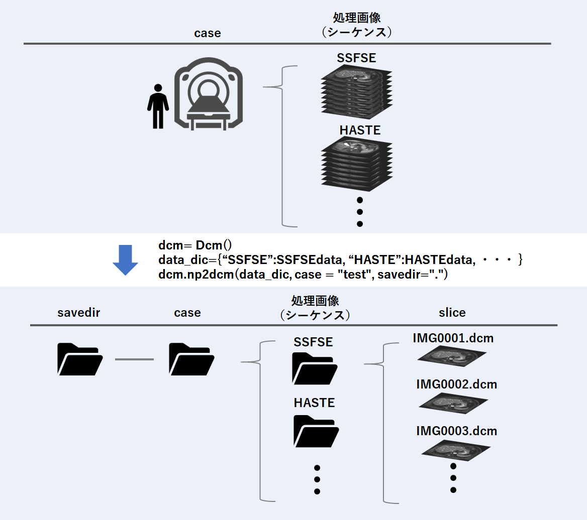

#  Numpy array to Dicom file

## ! Can create dicom files without preparing dummy files

# Getting Started
## Installation
- numpy
- pydicom
- PIL

# Usage 
### The shape of the input images should be (D,H,W) or (D,H,W,RGB) and the data type should be an integer.(uint8 recommend)  
**For more information, see sample.ipynb**  
! It includes the procedure for creating an overlay of the images  
Note : The overlay image is represented in RGB and may not be seen by some DicomViewers  
